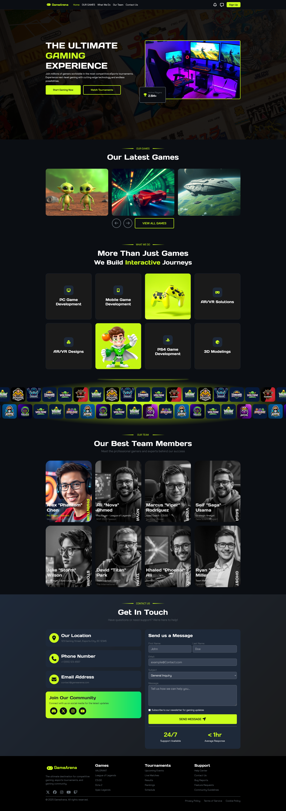

# Assignment 6
 Assignment 6 of the route courses where I learned how to build responsive layouts using Bootstrap's grid system and utility classes, customize components with my own CSS classes, integrate icons using Font Awesome, and combine framework-based styling with custom designs to create clean, modern, and maintainable user interfaces. This was submitted on May, 23rd, 2026.
## Screenshot
